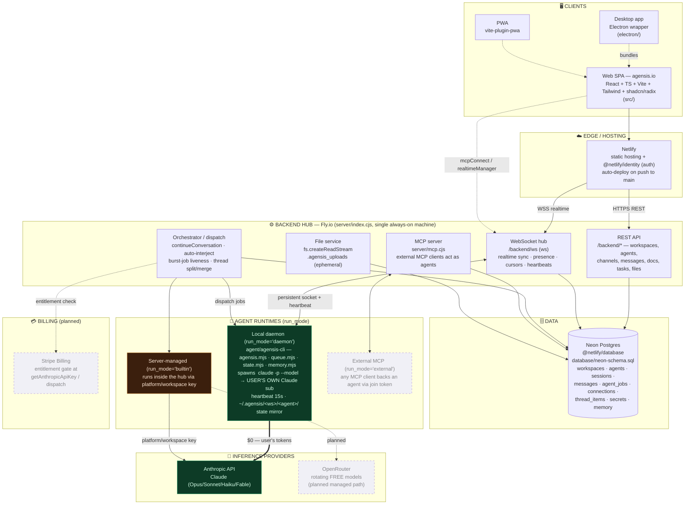

# agensis — Architecture

> One workspace, many agents, run anywhere, behave as one team.
> Diagram + layer map grounded in the actual repo (`server/`, `agent/agensis-cli/`, `src/`, `database/`).

## System diagram

## Layer map

| Layer | What it is | Where |
|---|---|---|
| **Clients** | React + TypeScript SPA (Vite, Tailwind, shadcn/radix). Same bundle powers the Electron desktop app and a PWA. Windowed canvas UI, chat, docs, tasks, themes (classic/neo/tinyworld). | `src/` (components, hooks, lib, providers) |
| **Client data plane** | Custom query builder over the backend (`backendClient.ts`), realtime subscriptions (`realtimeManager.ts`), MCP connect (`mcpConnect.ts`), offline cache (`offlineDb.ts`). | `src/lib/`, `src/hooks/` |
| **Edge / hosting** | Netlify serves the static build (auto-deploys on push to `main`) and provides identity/auth via `@netlify/identity`. | `netlify/`, Netlify |
| **Backend hub** | One Express process on Fly.io = REST + a `ws` WebSocket hub at `/backend/ws` + the agent orchestrator + an MCP server + a file service. Single always-on machine (`min_machines_running=1`). | `server/index.cjs`, `server/mcp.cjs`, `shared/backend-core.mjs`, `fly.toml`, `Dockerfile.fly` |
| **Orchestration** | Dispatches turns (`continueConversation`), auto-interject picks one agent to reply in `auto` channels, burst-job liveness prevents phantom-job wedges, thread split/merge, comment→DM mention dispatch. | `server/index.cjs` |
| **Data** | Neon Postgres (serverless, scale-to-zero). Stores everything except file bytes: workspaces, agents, chat_sessions, messages, `agent_jobs`, `agent_connections`, `thread_items`, `workspace_secrets`, memory. | Neon, `database/neon-schema.sql` |
| **File storage** | Upload bytes on local disk (`.agensis_uploads`), served via `fs.createReadStream`; only metadata + `content_sha256` (dedupe) in Neon. ⚠️ Fly volume not mounted → uploads are ephemeral across deploys. | `server/index.cjs` |
| **Agent runtimes** | Three `run_mode`s: **daemon** (local CLI, spawns `claude -p` on the user's own Claude sub — $0 inference), **builtin** (runs in the hub on the platform/workspace key), **external** (any MCP client backs an agent via a join token). | `agent/agensis-cli/src/` |
| **Inference** | Daemon path → Anthropic on the user's tokens (free to platform). Managed path → `getAnthropicApiKey` resolves a workspace secret, else the platform key. Planned: rotating **OpenRouter free models** for the managed path; frontier stays BYO-key. | `resolveSecret` / `getAnthropicApiKey` in `server/index.cjs` |
| **Billing (planned)** | Stripe Billing; entitlement gate goes server-side at `getAnthropicApiKey` / dispatch (where money is spent), not in React. | `docs/pricing/` |

## The two things that define the economics

1. **Daemon inference is free to the platform.** The local daemon shells out to `claude -p --model` using the *user's* Claude subscription. N daemons on N machines cost the hub ~nothing beyond a WebSocket.
2. **Managed inference is the only real cost lever.** Anything running on the platform key (auto-interject, builtin agents) spends real tokens — which is why the entitlement gate and the planned OpenRouter-free-models path both live on that single path.

## Realtime & liveness spine

- Daemons hold a persistent socket to `/backend/ws` and **heartbeat every 15s**, now carrying `capabilitiesHash` + `memoryHash` so skills/tools/memory drift is detected and re-synced.
- Each daemon mirrors state to `~/.agensis/<ws>/<agent>/` (`heartbeat.json`, `soul.md`, `status.json`) and can write its own status back.
- `agent_jobs` liveness ties a job's validity to its connection; phantom (NULL/dead-connection) jobs are finalized instead of wedging a session.

_Deploy split to remember: frontend ships on Netlify (push to `main`); the backend on Fly.io is a **manual `fly deploy`**; daemons pick up CLI changes on restart._
